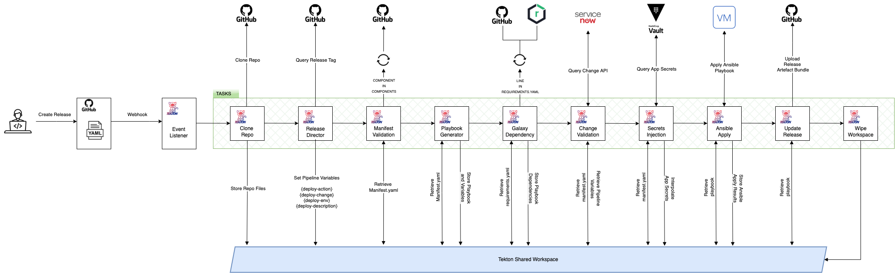

## TO Application Automation Technical Overview


### Introduction
App Automation is delivering a user consumable application deployment capability based on a number of modular ansible roles customised to deliver the capabilities required. The automation is driven from a YAML file in the application source repository in which consumers can specify capabilities from a curated catalogue, removing the necessity for teams to upskill and understand the target toolset whilst still codifying the deployment manifest.

 ##### Manifest
 
The manifest allows specification of application Troux ID, vault namespace, pinned versions of capabilities, the target server roles, the execution order and input parameters.

Example:
```
manifest example
```

##### Deployment Initiation
Deployments are initiated via the creation of a Release Tag. The release tag name informs the resulting actions in the deployment pipeline and allows the following parameters to be provided delimited by a hyphen (-):

 
- **Action:**  ```deploy``` *Currently only action supported*
- **Change Number:** ```CHG******``` . *Used to query ServiceNow for change validity.*
- **Environment:** ```development``` *Environment to deploy to. Used to select manifest and inventory from repository.*
- **Description:** ```string``` *User description to identify release. Alphanumeric, no spaces, no special characters*

**Example:** ```deploy-CHG123456-development-13102022```

  
Upon creation of a Github Release a Github web-hook is triggered which sends a JSON payload to a Tekton EventListener in OCP. This triggers the deploy pipeline which looks like this:



  
### Deployment Process

#### Pipeline Stages:

As part of the Tekton PipelineRun an ephemeral shared workspace is created to handle filesystem and pipeline persistence needs i.e. TaskRun variables and results.

##### 1. Clone Repo:

> Clone the application GHE repository at the revision specified in the webhook.

##### 2. Release Director:

> Query GHE for the release name, ensure it is in a valid format and store the directive sections as variables for use in the pipeline.


##### 3. Manifest Validation:

> Retrieves the relevant manifest.yaml file based on the Release tag directive and validates the format and parameter types using a JSONSchema validation file.

> **Base:** This validates the base manifest.yaml structure and value types.

> **Component:** This iterates through each of the items in the components array in the manifest and retrieves the JSONSchema validation file for the corresponding capability from the capability's Github repository. This validation file is then applied to the "capability_params" section of that component to validate the component structure and value types.

##### 4. Playbook Generator:

> Retrieves the relevant manifest.yaml and inventory files based on the Release tag directive and parses it to generate a playbook based on it's contents. The following artefacts are created.

> ***Playbook:***
> > A sequenced list of capabilities required to complete the deployment as specified in the manifest.yaml components array.

> ***Inventory:***
> > A list of role labelled servers to which the capabilities will be applied as specified in the inventory.yaml.

> ***Requirements:***
> > A list of the required capabilities as specified in the manifest.yaml file at their pinned versions.

> ***Variables:***
> > Capability seperated files containing the parameters required to perform the deployment as specified by the capabilities.

##### 5. Galaxy Dependency:
> Uses the Ansible Galaxy tool to retrieve from the relevant GHE repositories (by tag) and bundle the required Ansible Roles as dependencies specified in the requirements.yaml generated by the previous step.

##### 6. Change Validation:

> Queries the ServiceNow API to validate the change number provided in the Release name directive in combination with:

> - Implementation Status
> - Implementation Start
> - Implementation End
> - Environment
> - Platform
> - Troux ID ( As specified in the manifest.yaml )

##### 7. Secrets Injection:

> Queries the application vault namespace for secrets and certificates specified in the manifest.yaml and performs a replacement in the appropriate playbook variable files on the ephemeral Tekton workspace.


##### 8. Ansible Apply:

> Executes the Ansible playbook to perform the necessary deployment actions against the servers specified in the inventory.yaml file. This requires network connectivity and authentication to the target servers.

##### 9. Update Release:

> All actions in the pipeline update a PipelineRun log bundle for each action. These logs are bundled into a compressed file and published to the GHE Release that initiated the deploy. The status is also updated to reflect the result of the deployment (Success/Fail).

##### 10. Wipe Workspace:

> Deletes all files from the ephemeral Tekton workspace. Even though the shared workspace is ephemeral and is removed automatically by Tekton, because there are secrets stored for a short period of time to be used in the ansible playbook variables and inventory this is a extra measure to reduce exposure in the case of a malicious actor gaining access to the PVC before deletion.
